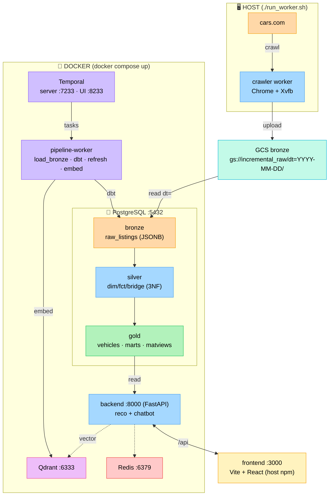
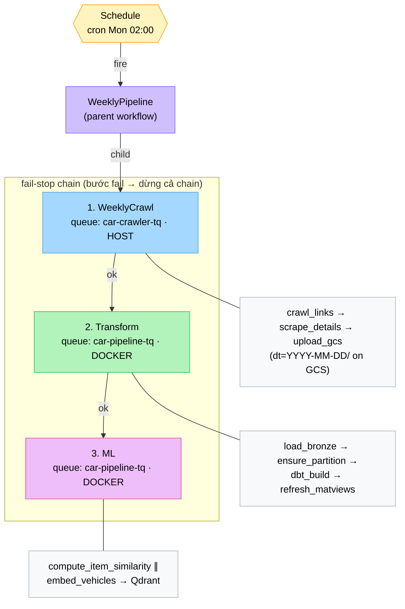
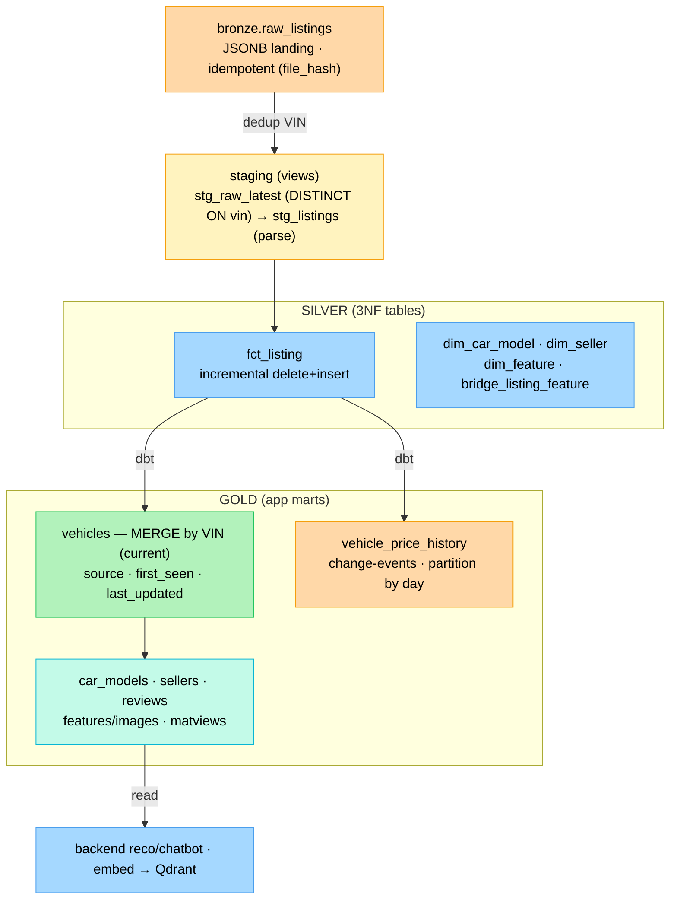
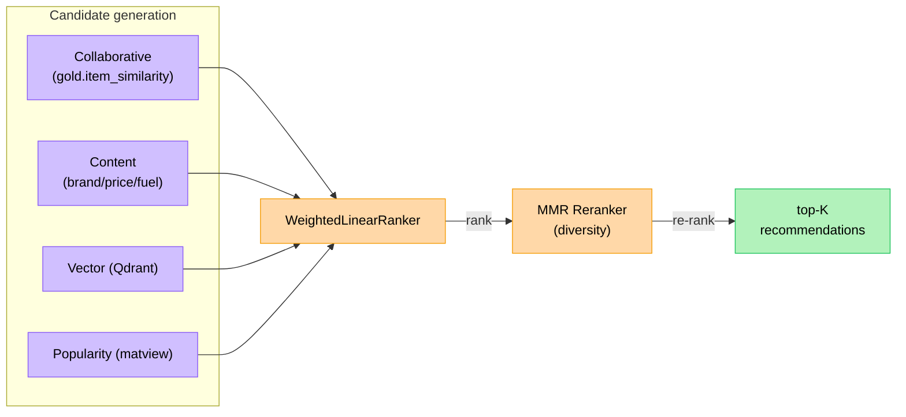
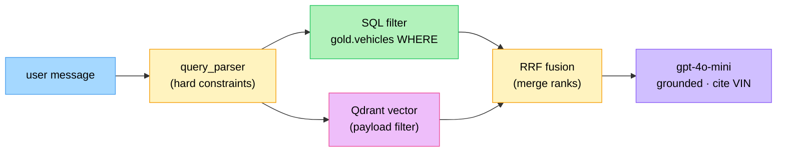

# Architecture Diagrams (Mermaid)

Các sơ đồ dưới đây dùng **Mermaid** — render trực tiếp trên GitHub, [mermaid.live](https://mermaid.live),
VSCode (extension *Markdown Preview Mermaid*), hoặc Notion. Đã verify render ra SVG hợp lệ.

> Muốn có logo Docker/Postgres/Temporal nhúng trong chart? Mermaid hỗ trợ qua
> `@{ icon: "logos:postgresql" }` (v11.3+) **nhưng chỉ hiển thị trên trình render bật
> *iconify*** (mermaid.live) — GitHub README sẽ hiện dấu `?`. Vì vậy các diagram dưới
> dùng **màu + label** để render đẹp ở mọi nơi.

---

## 1. Kiến trúc tổng thể

---

## 2. Temporal pipeline — WeeklyPipeline

---

## 3. dbt medallion — data flow

---

## 4. Recommendation engine (multi-stage hybrid)

---

## 5. Chatbot — RAG hybrid retrieval

